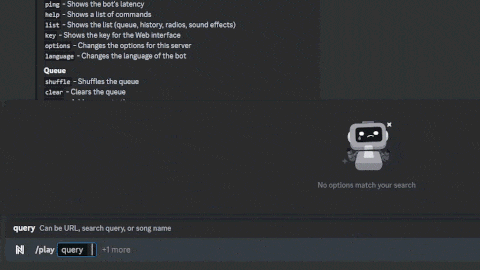

## About

This is a severally stripped down version of the original project [Nicholas the 7th](https://github.com/Tomer27cz/nicholas_the_7th).

### The bot now only has these features:

- Music streaming from `YouTube`, `SoundCloud`, and `Spotify (not really - YouTube search is used)`
- Radio streaming from `radia.cz`, `radio.garden`, and `tunein.com`
- Live search
- Queue system
- Looping
- Playlist detection
- Volume control
- Pause/Resume, Stop, and Skip
- Shuffle, Clear, List, and Remove from queue
- Large Language selection

### Notable changes:

- No Web interface
- No History
- No Sound effects
- No Playlists
- No Torture / Slow mode
- No Chat Export

It is not meant to be used by anyone else, but if you want to use it, feel free to do so.

## [Setup Guide](.github/SETUP.md)

### Live Search

# [More in Screenshots](.github/SCREENSHOTS.md)

## License

[MIT](https://choosealicense.com/licenses/mit/)

## Contributing

If you want to contribute to this project, feel free to do so. I am not very experienced with python, so I am sure there are many things that can be improved.
